# System Overview

End-to-end flow from hardware microphone to hardware speaker.

```mermaid
flowchart TD
    MIC[🎤 Hardware Microphone]
    ALSA[ALSA Driver\nkernel / OS]
    PA[PulseAudio\nOS audio server]
    AEC[module-echo-cancel\nWebRTC AEC\nauto-detected at startup]
    PYAUDIO_IN[PyAudio\nreads PCM frames]
    PORCUPINE[Porcupine\nWake Word Detection]
    VAD[WebRTC VAD\nVoice Activity Detection]
    WAV[pcm_frames_to_wav\nPCM → WAV bytes]
    ASR[ASR Service\nHTTP POST]
    LLM[LLM Service\nHTTP POST]
    TTS[TTS Service\nHTTP POST]
    PYAUDIO_OUT[PyAudio\nwrites PCM frames]
    PA_OUT[PulseAudio\nOS audio routing]
    SPK[🔊 Hardware Speaker]

    MIC --> ALSA --> PA --> AEC --> PYAUDIO_IN
    PYAUDIO_IN --> PORCUPINE
    PORCUPINE -->|wake word heard| VAD
    VAD -->|utterance complete| WAV
    WAV --> ASR -->|text| LLM -->|reply| TTS -->|WAV bytes| PYAUDIO_OUT
    PYAUDIO_OUT --> PA_OUT --> SPK

    style AEC fill:#fffbe6,stroke:#f0c040
    style PORCUPINE fill:#e6f0ff,stroke:#4080c0
    style VAD fill:#e6f0ff,stroke:#4080c0
    style ASR fill:#e6ffe6,stroke:#40a040
    style LLM fill:#e6ffe6,stroke:#40a040
    style TTS fill:#e6ffe6,stroke:#40a040
```

## Layer Legend

| Layer | Components | Location |
|---|---|---|
| Hardware | Microphone, Speaker | Physical |
| OS / Kernel | ALSA driver | Kernel |
| OS / Audio server | PulseAudio, AEC | User-space OS |
| App — I/O | PyAudio | Inside binary |
| App — Wake word | Porcupine | Inside binary |
| App — VAD | WebRTC VAD | Inside binary |
| App — AI services | ASR, LLM, TTS | Network (HTTP) |
