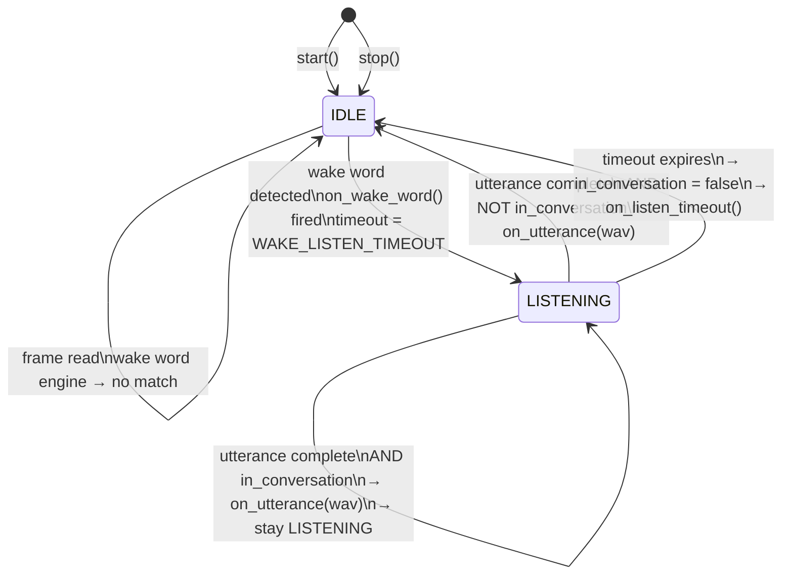
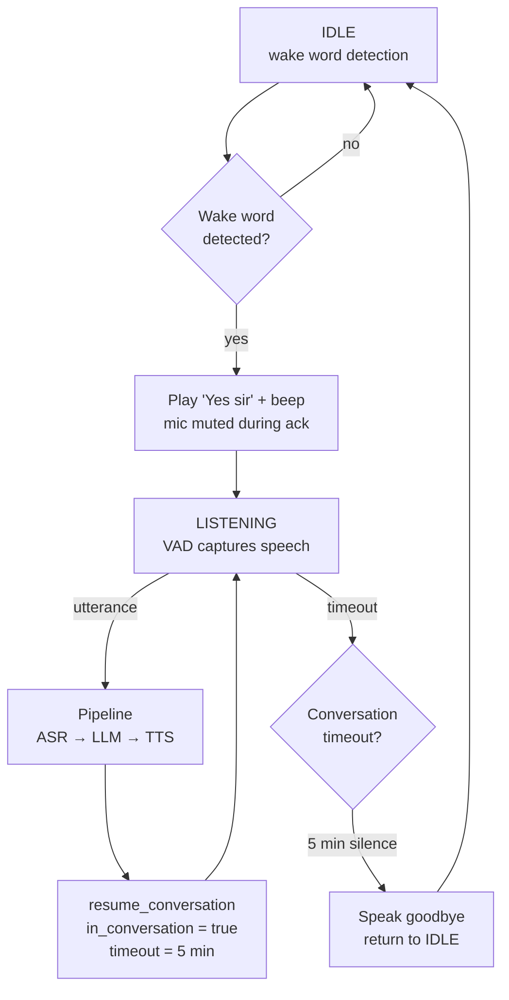
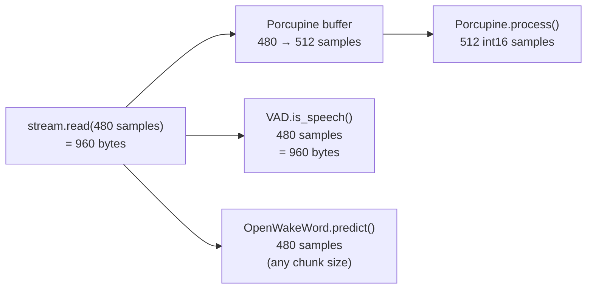

# Microphone Capture — State Machine

`MicrophoneCapture` in `src/capture.py` runs a continuous loop with two states and a **conversation mode** flag.

## Conversation Mode

After the first wake word + reply cycle, the system enters **conversation mode**:
the user can keep asking questions without repeating the wake word.
Conversation mode ends after `CONVERSATION_TIMEOUT_MS` (default 5 minutes) of silence.

```
Hey Jarvis → "Yes sir" → Q1 → reply → Q2 (no wake word!) → reply → ... → 5 min silence → IDLE
```

## State Diagram



## Conversation Flow



## Frame Size Reconciliation

Wake word engines and WebRTC VAD require different frame sizes:



## Key Timing Values

| Parameter | Value | Config key |
|---|---|---|
| VAD frame size | 30 ms / 480 samples | `MIC_CHUNK_MS` |
| Pre-speech padding | ~300 ms (10 frames) | `_PADDING_CHUNKS` |
| Silence to end utterance | 1200 ms | `VAD_SILENCE_MS` |
| Minimum utterance length | 2000 ms | `VAD_MIN_SPEECH_MS` |
| Listen timeout after wake word | 10000 ms | `WAKE_LISTEN_TIMEOUT_MS` |
| Conversation timeout | 300000 ms (5 min) | `CONVERSATION_TIMEOUT_MS` |
| VAD aggressiveness | 3 (most aggressive) | `VAD_AGGRESSIVENESS` |
