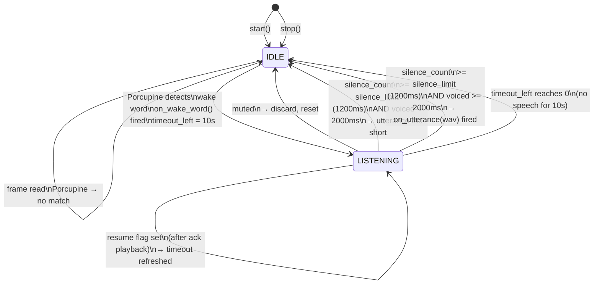
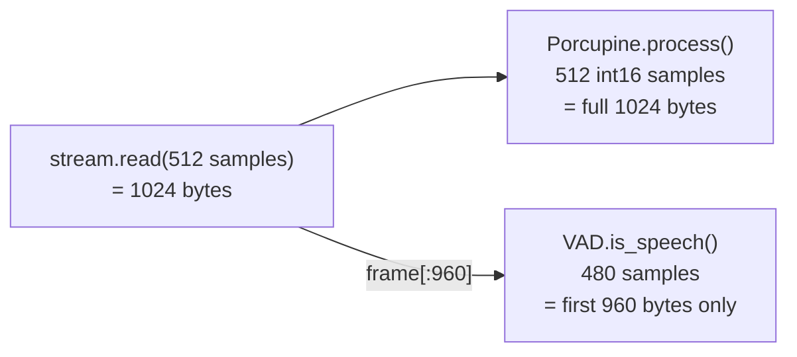

# Microphone Capture — State Machine

`MicrophoneCapture` in `src/capture.py` runs a continuous loop with two states.

## Frame Size Reconciliation

Porcupine and WebRTC VAD require different frame sizes. Both are served from a single read:

## Key Timing Values

| Parameter | Value | Config key |
|---|---|---|
| VAD frame size | 30 ms / 480 samples | `MIC_CHUNK_MS` |
| Pre-speech padding | ~300 ms (10 frames) | `_PADDING_CHUNKS` |
| Silence to end utterance | 1200 ms | `VAD_SILENCE_MS` |
| Minimum utterance length | 2000 ms | `VAD_MIN_SPEECH_MS` |
| Listen timeout after wake word | 10000 ms | `WAKE_LISTEN_TIMEOUT_MS` |
| VAD aggressiveness | 3 (most aggressive) | `VAD_AGGRESSIVENESS` |
