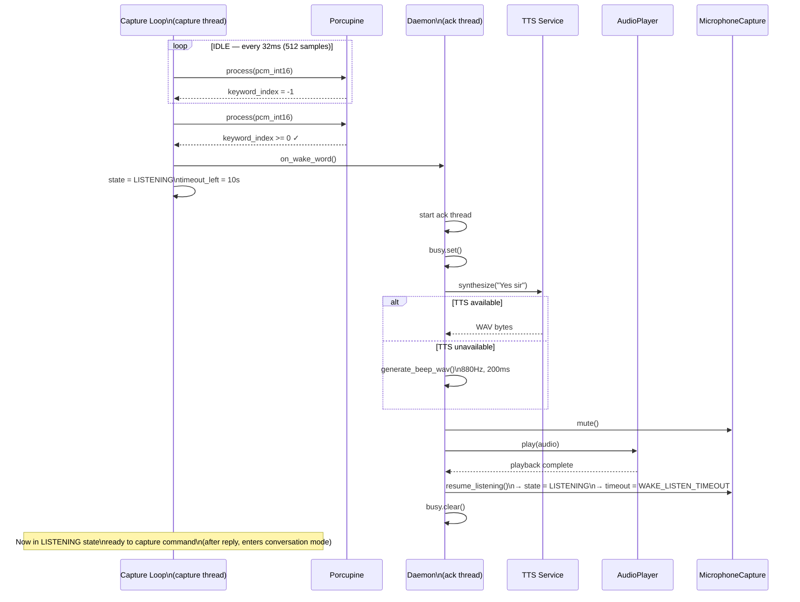
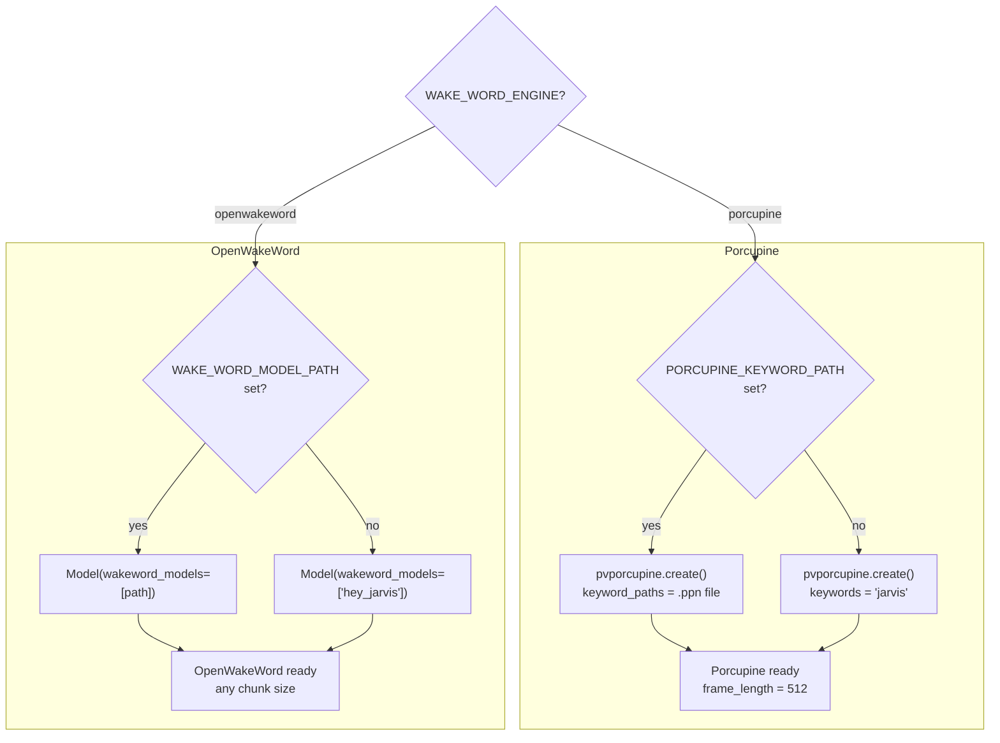

# Wake Word Detection Flow

What happens from the moment the wake word is heard to when the robot is ready to listen.



## Wake Word Configuration



## Built-in Keywords Available for Testing

```
alexa        americano    blueberry    bumblebee
computer     grapefruit   grasshopper  hey google
hey siri     jarvis       ok google    picovoice
porcupine    terminator
```

> **Note:** Built-in keywords are for testing only. Use a custom `.ppn` file for production ("Hey Robot").
