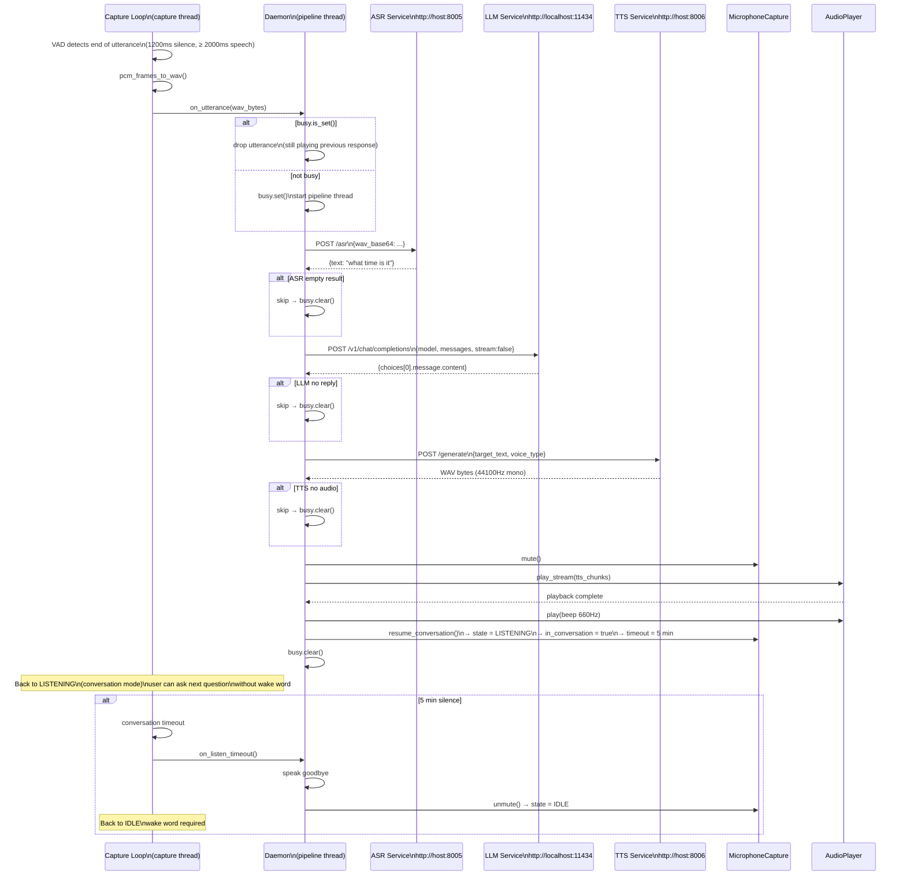
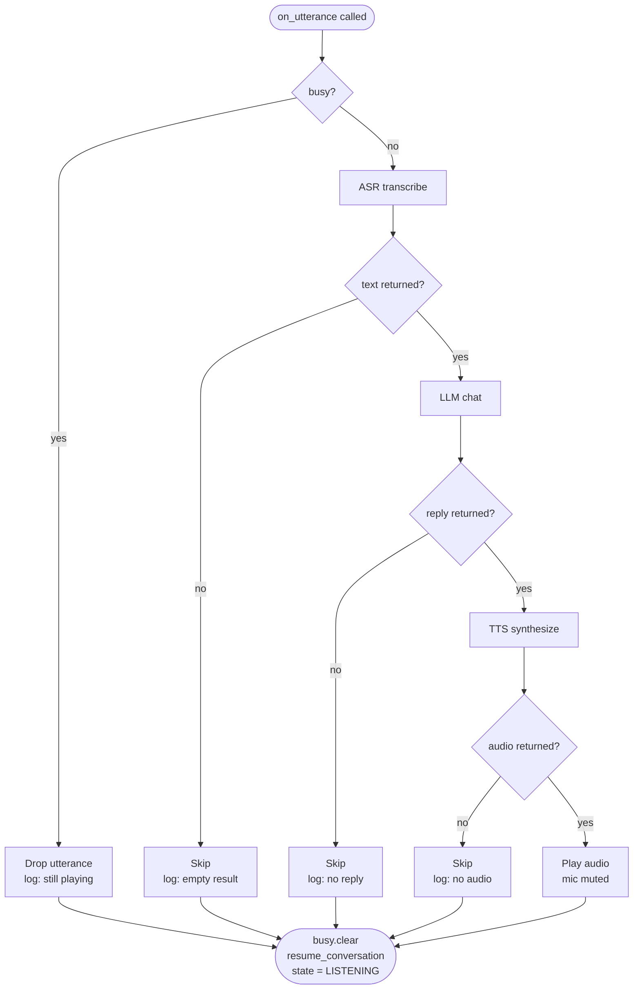

# Pipeline Flow

Full flow from captured utterance through ASR → LLM → TTS → playback.

## Pipeline Error Handling

## HTTP Timeout Configuration

| Service | Timeout | Config key |
|---|---|---|
| ASR | 30s | `ASR_TIMEOUT` |
| LLM | 60s | `LLM_TIMEOUT` |
| TTS | 60s | `TTS_TIMEOUT` |
