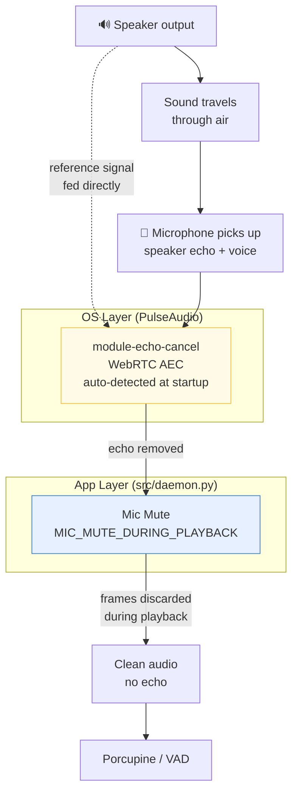
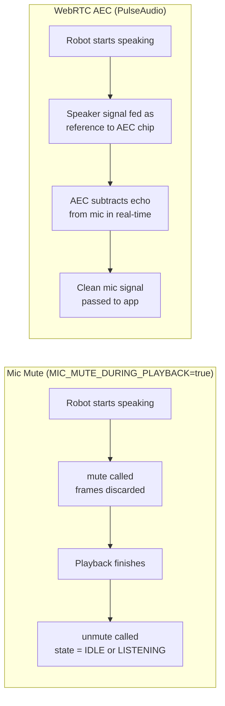
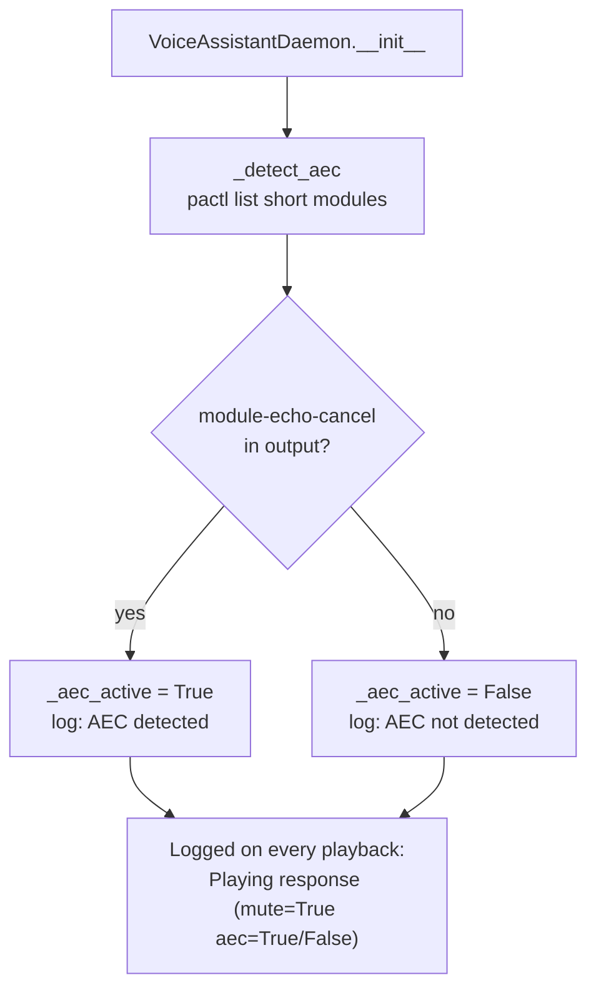

# Echo Cancellation

Two independent layers of echo protection — both can be active simultaneously.

## Strategy Comparison

## Startup AEC Detection

## Configuration

| Setting | Default | Description |
|---|---|---|
| `MIC_MUTE_DURING_PLAYBACK` | `true` | Mute mic in software during playback |
| AEC | auto-detected | Reads PulseAudio modules at startup — no manual flag |

## Recommended Combinations

| Mic Mute | AEC | Barge-in | Best for |
|---|---|---|---|
| ✓ | ✗ | No | Simple robot, no PulseAudio setup |
| ✗ | ✓ | Yes | PulseAudio AEC configured |
| ✓ | ✓ | No | Maximum robustness (recommended) |
| ✗ | ✗ | — | ⚠️ No protection — not recommended |
