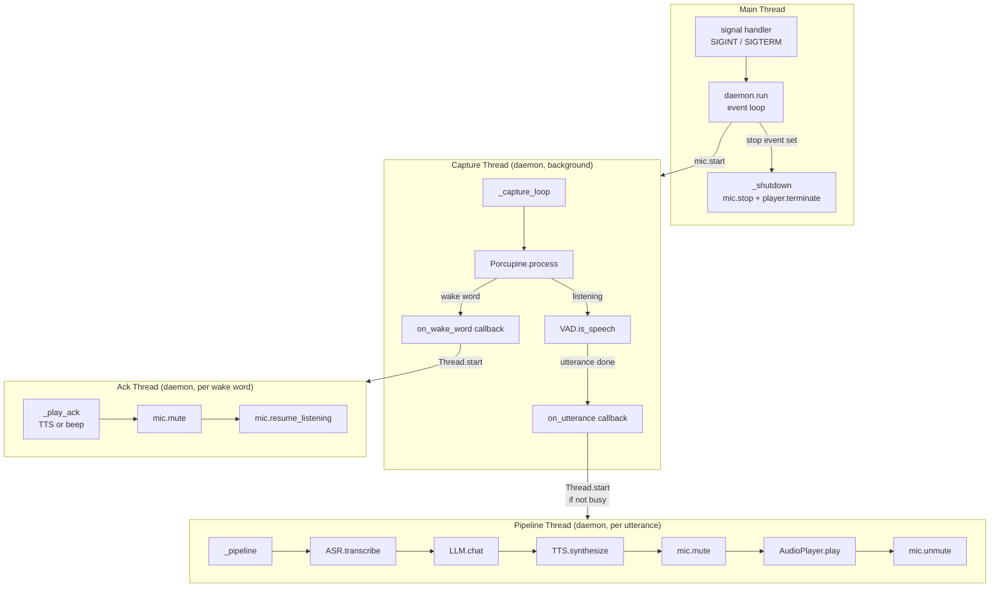
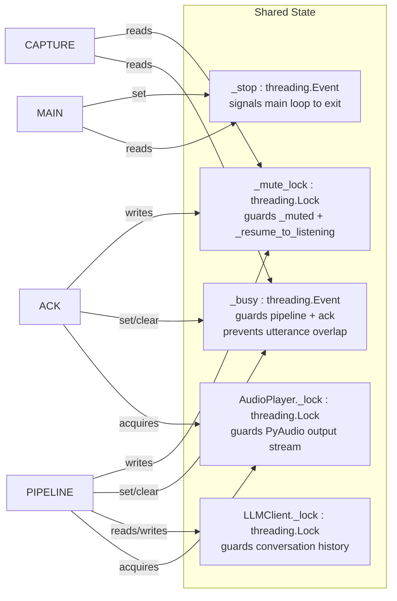

# Threading Model

The daemon uses three thread types with clear ownership boundaries.

## Shared State & Synchronisation

## Thread Lifecycle

```mermaid
gantt
    title Thread activity timeline (example interaction)
    dateFormat ss
    axisFormat %S s

    section Main Thread
    Event loop (sleep 0.5s) : 00, 20s

    section Capture Thread
    IDLE - Porcupine scanning : 00, 03s
    Wake word detected        : 03, 01s
    LISTENING - VAD active    : 04, 05s
    IDLE - waiting next word  : 09, 11s

    section Ack Thread
    TTS / beep + playback     : 03, 02s

    section Pipeline Thread
    ASR transcribe            : 09, 02s
    LLM generate              : 11, 03s
    TTS synthesize            : 14, 02s
    AudioPlayer play          : 16, 03s
```

## Key Rules

| Rule | Reason |
|---|---|
| Only one pipeline thread at a time (`_busy`) | Prevents overlapping ASR/LLM/TTS calls and audio |
| `_busy` also set during ack playback | Prevents utterance captured during ack from starting pipeline |
| Capture thread never blocks on network | All HTTP calls happen in pipeline/ack threads |
| `AudioPlayer` has its own lock | Safe if ack and pipeline race to play (queued, not crashed) |
| `resume_listening()` vs `unmute()` | Ack → LISTENING, pipeline → IDLE |
